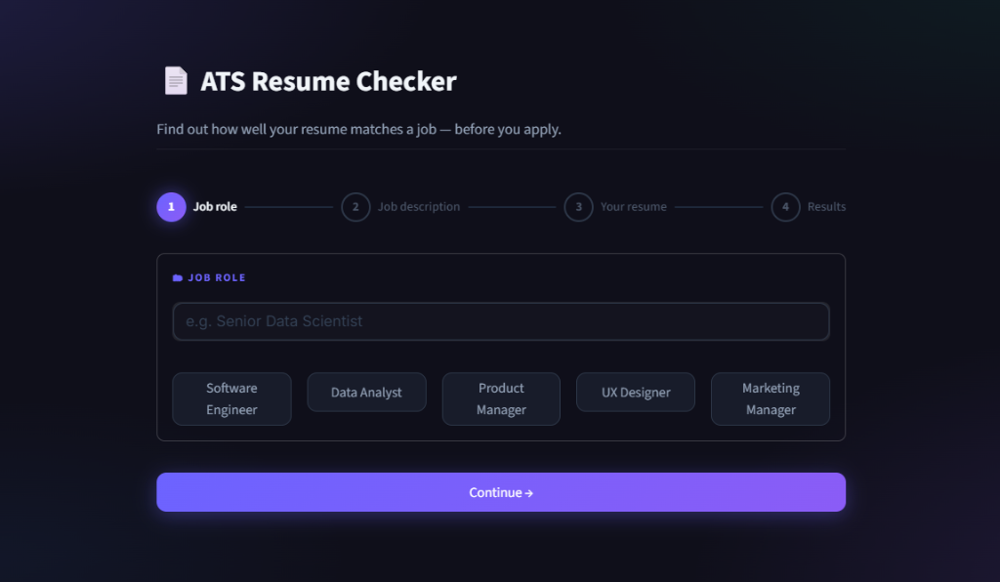

# 🚀 ATS Resume Analyzer

An intelligent, AI-powered Applicant Tracking System (ATS) checker built with Python, Streamlit, and Google's Gemini API. This application analyzes resumes against job descriptions to provide a comprehensive match score, keyword analysis, and actionable improvement suggestions.



## ✨ Features
- **AI-Powered Analysis**: Uses Google Gemini to deeply analyze your resume against the job description.
- **Detailed Scoring**: Breaks down your ATS score into Keywords, Skills, Experience, Education, and Formatting.
- **Keyword Extraction**: Identifies both matching keywords and critical missing keywords to help you pass ATS filters.
- **Actionable Feedback**: Generates specific strengths and concrete steps to improve your resume.
- **PDF Report Generation**: Download a beautifully formatted, professional PDF report of your analysis.
- **Sleek UI**: Modern, glassmorphism design with a dark mode aesthetic and animated backgrounds.

## 🛠️ Technologies Used
- **Frontend**: Streamlit
- **AI/LLM**: Google Gemini API
- **PDF Generation**: ReportLab
- **Resume Parsing**: PyMuPDF (`fitz`), `docx2txt`

## 🚀 Quick Start

### 1. Clone the repository
```bash
git clone https://github.com/Ranit32/ATS-Resume-Analyzer.git
cd ATS-Resume-Analyzer
```

### 2. Install dependencies
```bash
pip install -r requirements.txt
```

### 3. Setup Environment Variables
Create a `.env` file in the root directory and add your Google Gemini API key:
```env
GEMINI_API_KEY=your_api_key_here
```
*(You can get a free API key from [Google AI Studio](https://aistudio.google.com/))*

### 4. Run the Application
```bash
streamlit run app.py
```
Then open `http://localhost:8501` in your browser.

## 📁 Project Structure
- `app.py`: Main Streamlit application and UI flow.
- `utils/ats_analyzer.py`: AI integration, prompt engineering, and PDF report generation.
- `utils/resume_parser.py`: Robust PDF and DOCX text extraction.
- `utils/styles.py`: Custom CSS and background animations.

## 📄 License
This project is open-source and available under the MIT License.